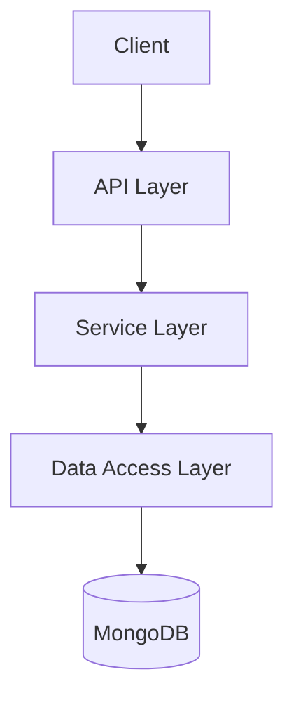
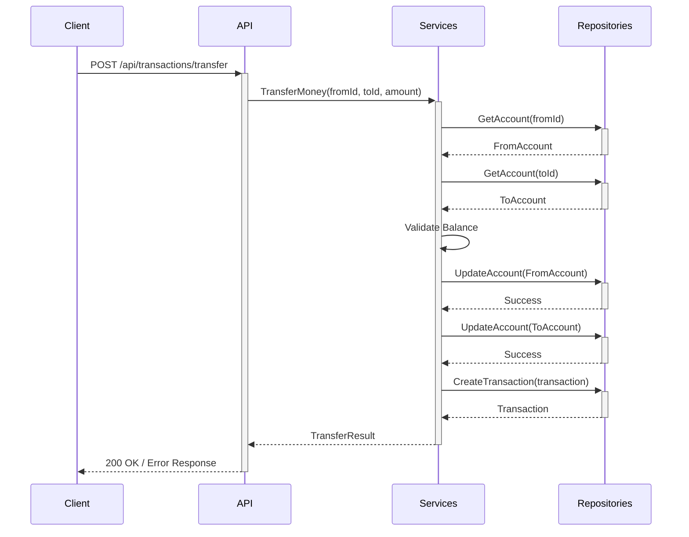
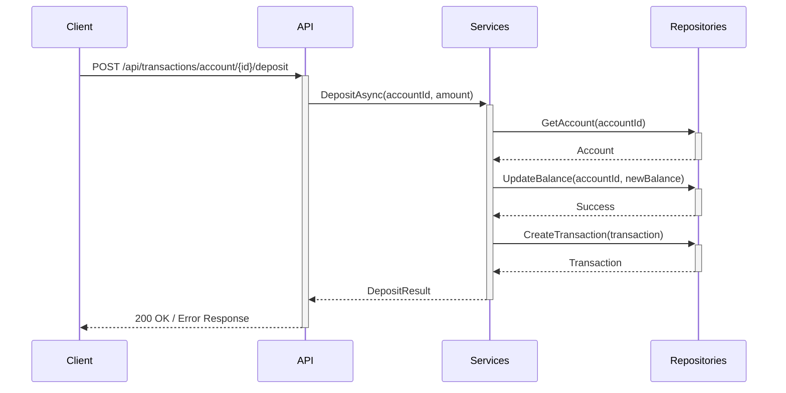
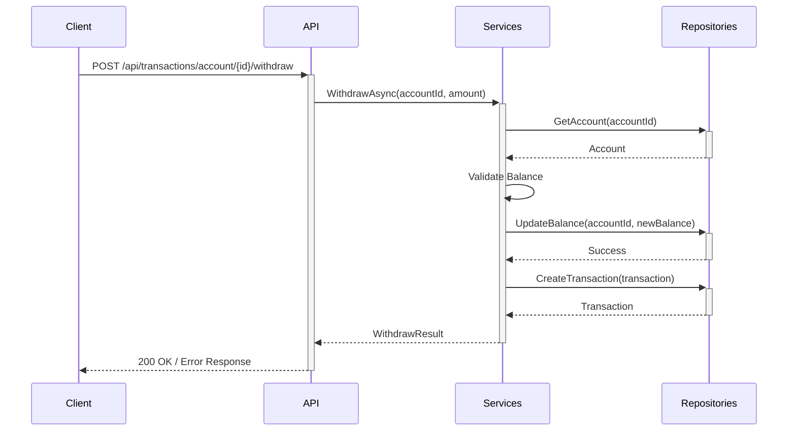

# Bank Account Management System Architecture

## Overview
This document outlines the architecture for a .NET 6 Web API application that manages bank accounts and transactions using MongoDB as the database. The application follows a layered architecture with clear separation of concerns.

## System Requirements
- Create, retrieve bank accounts
- Transfer money between accounts
- Deposit money into accounts
- Withdraw money from accounts
- Record and retrieve transaction history
- Validate account balances during transfers and withdrawals

## Architecture Layers

### 1. API Layer
- REST API endpoints for account and transaction operations
- Request/response models
- Input validation
- Swagger UI integration

### 2. Service Layer
- Business logic implementation
- Transaction validation
- Balance management
- Service interfaces and implementations

### 3. Data Access Layer
- Repository interfaces and implementations
- MongoDB context configuration
- Entity models and mapping

## Domain Models

### Account
```csharp
public class Account
{
    public string Id { get; set; }
    public string AccountName { get; set; }
    public decimal Balance { get; set; }
}
```

### Transaction
```csharp
public class Transaction
{
    public string Id { get; set; }
    public string FromAccountId { get; set; }
    public string ToAccountId { get; set; }
    public decimal Amount { get; set; }
    public DateTime Timestamp { get; set; }
    public string Description { get; set; }
    public TransactionStatus Status { get; set; }
}

public enum TransactionStatus
{
    Pending,
    Completed,
    Failed
}
```

## API Endpoints

### Account Endpoints
- `GET /api/accounts` - Get all accounts
- `GET /api/accounts/{id}` - Get account by ID
- `POST /api/accounts` - Create new account

### Transaction Endpoints
- `GET /api/transactions/account/{accountId}` - Get transactions for an account
- `POST /api/transactions/transfer` - Transfer money between accounts
- `POST /api/transactions/account/{accountId}/deposit` - Deposit money into an account
- `POST /api/transactions/account/{accountId}/withdraw` - Withdraw money from an account

## Database Design

### MongoDB Collections
- Accounts
- Transactions

## Component Diagram



## Sequence Diagrams

### Money Transfer



### Deposit Money



### Withdraw Money



## Testing Strategy
- Unit tests for service layer logic
- Repository tests with in-memory MongoDB
- API integration tests

## Project Structure
```
BankAccountManagement/
├── BankAccountManagement.API/
│   ├── Controllers/
│   ├── Models/
│   ├── Program.cs
│   └── appsettings.json
├── BankAccountManagement.Core/
│   ├── Entities/
│   ├── Interfaces/
│   └── Services/
├── BankAccountManagement.Infrastructure/
│   ├── Data/
│   ├── Repositories/
│   └── Extensions/
└── BankAccountManagement.Tests/
    ├── Services/
    ├── Repositories/
    └── Controllers/